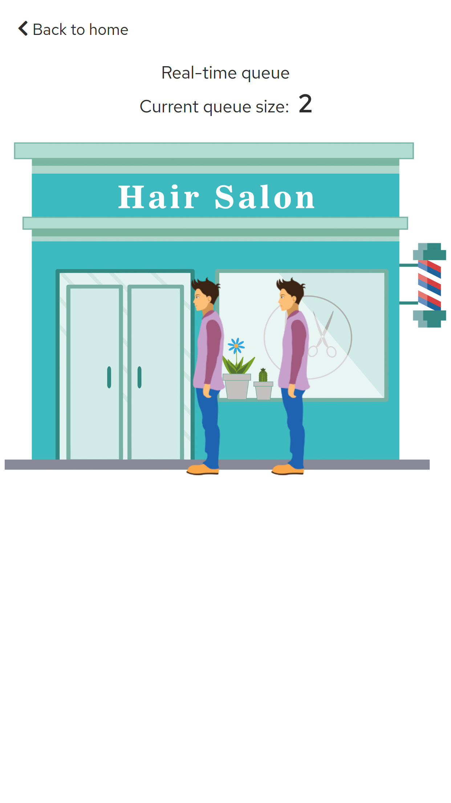

# Capstone

The final CS50W project with python and javascript 🤓💻

[](https://www.youtube.com/watch?v=XEEUfunFHO0 "final-project-cs50w")

# Installation

\* Obs: Python version used in this project: 3.9.1

<details>
<summary>Linux:</summary>

1. First of all let's clone the repository:

```
git clone https://github.com/Matheus-IT/capstone.git
```

2. In the root directory of the project (`cd capstone`), you can create a virtual environment using:

```
python3 -m venv venv
```

3. Then, to activate the virtual environment run:

```
source venv/bin/activate
```

4. And finally, to install all dependencies this project requires just run:

```
pip3 install -r requirements.txt
```

You should see a message saying that everything was installed.

---

> **Notice**: If for some reason when you ran `python3 -m venv venv` from step 3 you got an error that said: "The virtual environment was not created successfully because ensurepip is not available. On Debian/Ubuntu systems, you need to install the python3-env package using the following command":

```
apt install python3.9-env
```

> If it does not work try using sudo:

```
sudo apt install python3.9-env
```

</details>

<details>
<summary>Windows:</summary>

1. First of all let's clone the repository:

```
git clone https://github.com/Matheus-IT/capstone.git
```

2. In the root directory of the project (`cd capstone`), you can create a virtual environment using:

```
python3 -m venv venv
```

3. Then, to activate the virtual environment run:

```
venv/bin/activate.bat
```

4. And finally, to install all dependencies this project requires just run:

```
pip3 install -r requirements.txt
```

You should see a message saying that everything was installed.

---

> **Notice**: In my experience on windows, when I ran `pip install -r requirements.txt` I got an error that said at the bottom:

```
ERROR: Command errored out with exit status 1: 'c:\users\mathe\documents\my django projects\capstone\venv\scripts\python.exe' -u -c 'import sys, setuptools, tokenize;
sys.argv[0] = '"'"'C:\\Users\\mathe\\AppData\\Local\\Temp\\pip-install-fljag7l5\\twisted_1cbe426cceda4bfca6c98c224e54b0d1\\setup.py'"'"'; __file__='"'"'C:\\Users\\mathe
\\AppData\\Local\\Temp\\pip-install-fljag7l5\\twisted_1cbe426cceda4bfca6c98c224e54b0d1\\setup.py'"'"';f=getattr(tokenize, '"'"'open'"'"',
open)(__file__);code=f.read().replace('"'"'\r\n'"'"', '"'"'\n'"'"');f.close();exec(compile(code, __file__, '"'"'exec'"'"'))' install --record 'C:\Users\mathe\AppData
\Local\Temp\pip-record-a08vaq1a\install-record.txt' --single-version-externally-managed --compile --install-headers 'c:\users\mathe\documents\my django projects\capstone
\venv\include\site\python3.9\Twisted' Check the logs for full command output.
```

To fix this I went to [this site](https://www.lfd.uci.edu/~gohlke/pythonlibs/#twisted) and downloaded this file
`Twisted-20.3.0-cp39-cp39-win_amd64.whl`, where "cp39" corresponds to the python version. After that I ran
`pip install path/to/file/Twisted-20.3.0-cp39-cp39-win_amd64.whl` and it installed this dependency successfully.
And then I tried again `pip install -r requirements.txt`, the installation was complete.

</details>

<details>
<summary>Mac:</summary>
I couldn't test on Mac OS, but the steps might be the same as the ones for <strong>linux</strong>.
</details>
<br>
<br>

---

# Running the app

To run the application is required to have passed through the [installation step](#installation). With that out of the way, we need to apply the migrations:

```
python3 manage.py migrate
```

Then just run the server:

```
python3 manage.py runserver
```

---

# Distinctiveness and Complexity

This project was planned based on an idea @Matheus-IT had, therefore it is completely different than the other projects in this course, but using the knowledge that was acquired throughout the course. The idea was to create a website for a barber shop / hair salon which would be responsive to mobile and desktop designs, and focused on creating a better user interface and experience.

<figure>
    
    <figcaption>Design from a desktop prospective</figcaption>
</figure>
<br>
<br>

<figure>
    
    <figcaption>Design from a mobile prospective</figcaption>
</figure>
<br>
<br>

In addition to that, to deliver a good user experience in a barber shop / hair salon a nice website is not always enough. Based on a personal experience, most of the time when someone goes to a hair salon is spent a significant amount of time waiting for other people to get their hair cut. For this reason was developed a real-time queue that can be accessed by the clients, and is controlled by the hair stylist. This way a busy person can check how many people are waiting to be seen and choose a better time to come to the salon.

<figure>
    
    <figcaption>Real-time queue</figcaption>
</figure>
<br>
<br>

<figure>
    
    <figcaption>Real-time queue size control</figcaption>
</figure>
<br>
<br>

---

# File structure description

```
├── capstone/  -> core application
│   ├── asgi.py  -> asgi interface configuration
│   ├── settings.py
│   └── urls.py  -> global urls mapping
├── controlqueue/  -> app to control the interactive queue size
│   ├── migrations/
│   │   └── 0001_initial.py
│   ├── static/
│   │   └── controlqueue/
│   │       ├── JavaScript/
│   │       │   └── adminQueueControl.js  -> interaction for queue size control
│   │       └── styles/
│   │           ├── _globals.scss  -> global styles for the queue control
│   │           ├── _mixins.scss  -> breakpoints for screens
│   │           ├── _restrict.scss  -> styles for restrict warning
│   │           └── styles.scss  -> styles to be rendered by sass
│   ├── templates/
│   │   └── controlqueue/
│   │       ├── base.html  -> base for templates
│   │       ├── noticeAdminOnly.html  -> markup for warning admin users only
│   │       └── restrict.html  -> markup for restrict area of control queue
│   ├── tests/
│   │   └── test_views.py  -> tests for views and queue control behavior
│   ├── admin.py
│   ├── apps.py
│   ├── consumers.py  -> it's like the views, but for websocket connections
│   ├── models.py  -> application modules, which contains the queue module
│   ├── routing.py  -> similar to urls but for websocket routing
│   ├── urls.py  -> url mapping for real time queue page and else related
│   └── views.py  -> views for http requests
├── demo/  -> example images readme file on github
│   ├── home-desktop.png  -> home for desktop design
│   └── home-mobile.png  -> home for mobile design
├── mysite/  -> main app to manage the website as a whole
│   ├── migrations/
│   │   ├── 0001_initial.py
│   │   ├── 0002_userfeedback.py
│   │   └── 0003_userfeedback_created_at.py
│   ├── static/
│   │   └── mysite/
│   │       ├── images/
│   │       │   ├── indexPage/
│   │       │   │   ├── feedback-background.jpg  -> background of feedback section
│   │       │   │   ├── landing-background.jpg  -> background of home page section
│   │       │   │   ├── location-map.png  -> static image to represent location
│   │       │   │   ├── logo-white.png  -> logo of home page
│   │       │   │   ├── moustache-white.png  -> website logo
│   │       │   │   ├── services-background.jpg  -> used for services section
│   │       │   │   └── user.png  -> representation of user logo
│   │       │   ├── booking-form-background.png  -> background for booking form
│   │       │   ├── booking-form-service-background.jpg  -> used in step "choose service"
│   │       │   ├── hairSalon.png  -> salon picture for the real time queue
│   │       │   ├── person.png  -> person waiting in line
│   │       │   └── person-walking.gif  -> walking to show queue progress
│   │       ├── JavaScript/
│   │       │   ├── bookingForm/
│   │       │   │   ├── calendar.js  -> calendar for booking form date
│   │       │   │   └── script.js  -> general script for booking form
│   │       │   ├── indexPage/
│   │       │   │   ├── feedbackInteractivity.js  -> give and load user feedback
│   │       │   │   ├── hamburgerMenu.js  -> mobile menu for home page
│   │       │   │   └── servicesSection.js  -> services carousel
│   │       │   ├── handleQueue.js  -> waiting queue page interaction
│   │       │   └── index.js  -> handlers for receiving updates of real time queue
│   │       └── styles/
│   │           ├── abstracts/
│   │           │   ├── _animations.scss  -> global animations
│   │           │   ├── _breakpoints.scss  -> adjust different screen sizes
│   │           │   ├── _colors.scss  -> application colors pallet
│   │           │   ├── _globals.scss  -> general styles
│   │           │   └── _index.scss  -> file to spread the modules of sass
│   │           ├── base/
│   │           │   ├── _atomicStyles.scss  -> atomic styles used in components
│   │           │   ├── _containers.scss  -> base containers
│   │           │   ├── _index.scss  -> file to spread the modules of sass
│   │           │   └── _typography.scss  -> typography related for components
│   │           ├── components/
│   │           │   ├── _buttons.scss  -> buttons to be used with components
│   │           │   ├── _index.scss  -> file to spread the modules of sass
│   │           │   └── _progressBar.scss  -> progress bar for booking form
│   │           ├── layout/
│   │           │   └── sections.scss  -> base styles for website sections
│   │           ├── pages/
│   │           │   ├── _bookingForm.scss  -> booking form page styles
│   │           │   ├── _index.scss  -> styles for the index page (or home page)
│   │           │   ├── _login.scss  -> styles for the login page
│   │           │   ├── _register.scss  -> styles for the register page
│   │           │   └── _waitingQueue.scss  -> styles for the waiting queue page
│   │           ├── vendors/
│   │           │   └── _fonts.scss  -> external fonts
│   │           └── styles.scss  -> sass file to be compiled to css
│   ├── templates/
│   │   └── mysite/
│   │       ├── base.html  -> base template
│   │       ├── bookingForm.html  -> booking form page
│   │       ├── index.html  -> index page
│   │       ├── login.html  -> login page
│   │       ├── register.html  -> register page
│   │       └── waiting_queue.html  -> waiting queue page
│   ├── tests/
│   │   └── test_views.py  -> tests for the website views and api endpoints
│   ├── admin.py
│   ├── apps.py
│   ├── forms.py  -> forms to be rendered on the templates
│   ├── models.py  -> app models
│   ├── urls.py  -> urls to mysite
│   └── views.py  -> website views and api endpoints
├── manage.py
├── README.md  -> readme file with the instructions
└── requirements.txt  -> file that contains the project dependencies
```

<br>
<br>
